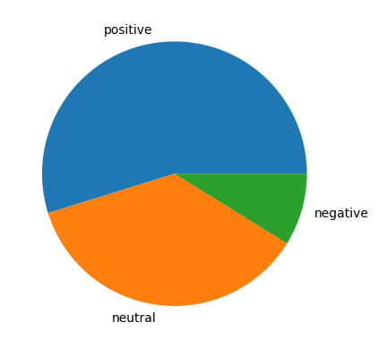
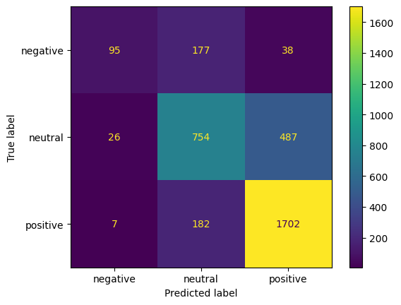
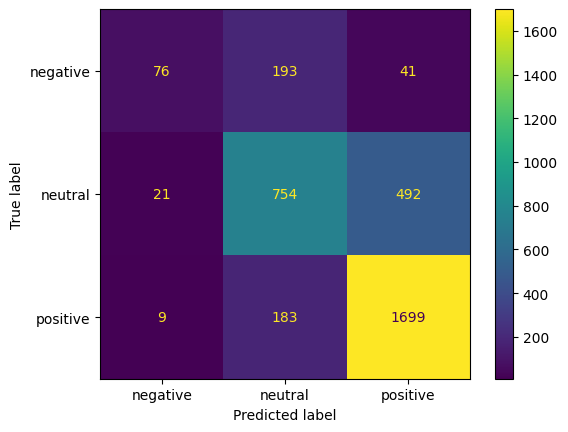

# Sentiment-classification-with-Naive-Bayes-classifier
In this repository, a sentiment analysis of the [Amazon Reviews](https://www.kaggle.com/datasets/danielihenacho/amazon-reviews-dataset) dataset is implemented. This dataset contains Amazon product reviews, classified into three categories: positive, neutral and negative. The Naive Bayes classifier is implemented in Python to perform the classification task on the dataset.

## Installation
Clone this repository:
```bash
git clone git@github.com:daniel-lima-lopez/Sentiment-classification-with-Naive-Bayes-classifier.git
```

move to installation directory:
```bash
cd Sentiment-classification-with-Naive-Bayes-classifier
```

## Method description
The Naive Bayes classifier is implemented in the [NB.py](NB.py) code, where its conventional definition is considered. The basic idea of ​​this classifier is, for each class, to calculate the conditional probability $P(c|d)$, that is, the probability that an instance $d$ belongs to class $c$, given the characteristics of $d$, class d is chosen as the one that maximizes this probability. Considering the Baye's rule, the predicted class $\hat{c}$ is calculated as follows:
$$\hat{c} = \begin{matrix}
argmax\\
c\in C
\end{matrix}\,\, P(c|d)=\begin{matrix}
argmax\\
c\in C
\end{matrix}\,\,\frac{P(d|c)P(c)}{P(d)}$$


where $P(d)$ is ignored, since its calculation independent of the class and $P(d|c)$ and $P(c)$ are calculated based on the word ocurrences in the training data.

## Experiments
The following experiments can be executed in the notebook [experiments.ipynb](experiments.ipynb).

First of all, the following pie chart shows the distribution of classes in the dataset:

<p style="text-align: center;">

</p>

Since there are imbalanced classes, we opt for F1-score as a performance metric. Experiments were performed with the Naive Bayes classifier and its binary counting variant, which is implemented by eliminating repeated words in every instance, this option is can be used definig `binary_count=True` on the declaration of the implemented class (`NaiveBayes()`). Both classifiers were evaluated with the F1 score under the same training-test split.

The F1-scores obtained are 0.6313 and 0.6062 for the naive bayes classifier and its binary-counting variant, respectively. In addition, the confusion matrices are shown below:


<p style="text-align: center;">
<strong>Naive Bayes </strong>
</p>

<p style="text-align: center;">

</p>

<p style="text-align: center;">
<strong>Binary-counting Naive Bayes </strong>
</p>

<p style="text-align: center;">

</p>

F1-score measures reveal that the conventional Naive Bayes classifier performs better than its binary counting variant. Furthermore, confusion matrices show that the conventional approach presents fewer misclassifications in classes with fewer instances (negative and neutral), which are the most difficult classes to classify, considering the imbalance in the classes presented in the data.